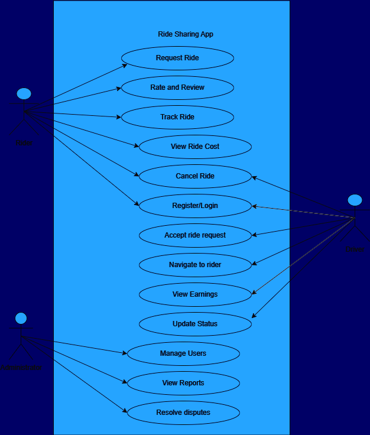

# Ride Sharing Use Case
The system is a ride-sharing application enabling Riders to book rides and Drivers to offer their services. Administrators oversee the platform to ensure smooth operations and address any disputes.

## List of actors and their responsibilities
* Rider: Can book rides, track their ride, review drivers, and manage bookings.
* Driver: Can accept ride requests, navigate to the rider's location, and manage their earnings.
* Administrator: Handles user accounts, oversees reports, and resolves disputes.

## Explanation of each usecase
* Request Ride: Rider initiates a ride request by selecting their pickup and drop-off locations.
* Rate and Review: Rider leaves feedback for the driver after a ride.
* Track Ride: Rider monitors the driver's progress and estimated arrival time.
* View Ride Cost: Rider reviews the cost of the ride before confirming.
* Cancel Ride: Rider can cancel a booked ride within certain conditions.
* Register/Login: Both Riders and Drivers must authenticate to access the system.
* Accept Ride Request: Driver receives and accepts a ride request from a Rider.
* Navigate to Rider: Driver uses navigation tools to locate the Rider.
* View Earnings: Driver reviews their earnings and completed trips.
* Update Status: Driver updates the ride status (e.g., "on the way," "completed").
* Manage Users: Administrator oversees user accounts, ensuring they are valid and active.
* View Reports: Administrator generates and views reports for insights and issue resolution.
* Resolve Disputes: Administrator addresses disputes between Riders and Drivers.

